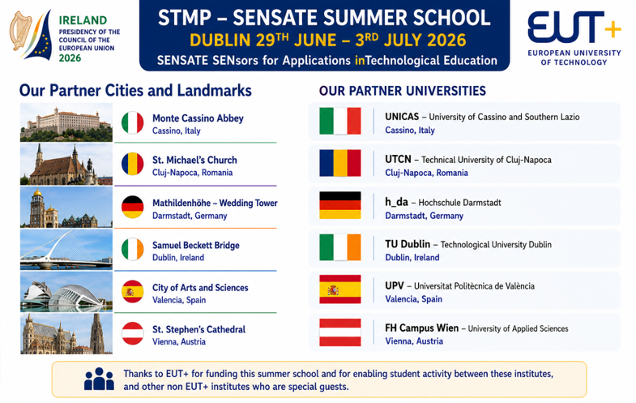

<p align="center">
  
</p>

# STMP26 SENSATE Blended Intensive Program (BIP)
Welcome to the official repository for the **STMP26 SENSATE Short Term Mobility Program**, hosted at the Tallaght Campus of Technological University Dublin (TU Dublin). 

This repository serves as the central hub for code, documentation, hardware diagnostic suites, and learning resources utilized during our international summer school.

---

## 🚀 Project Overview
The SENSATE program brings together students and staff from across Europe to collaborate on rapid prototyping, electronics engineering, and advanced sensor applications. The technical core of this program focuses on:
* **Microcontroller Programming:** Developing applications for the ESP32-S3 using the Arduino IDE environment.
* **Satellite Navigation & Security:** Investigating Global Navigation Satellite Systems (GNSS) with an emphasis on the Galileo Open Service Navigation Message Authentication (OSNMA) security features.
* **Hardware Integration:** Interfacing with TFT displays (ST7789), NeoPixels, and serial NMEA data.

---

## 📂 Repository Structure

* 📁 `code/` — Core firmware, libraries, and sample code for the project.
* 📁 `NMEA_Reader/` — Dedicated Arduino sketches for parsing and reading serial GNSS strings.
* 📁 `docs/` — Technical manuals, pinout guides, and presentation slides.
* 📁 `quizzes/` — Assessment materials and educational checkpoints.
* 📁 `images/` — Visual assets and project diagrams.
* 📁 `videos/` — Instructional video clips and demonstrations.

---

## 🛠️ Getting Started
1. **Clone the Repository:** 
   ```bash
   git clone [https://github.com/gstockiltud/BIP26Dublin.git](https://github.com/gstockiltud/BIP26Dublin.git)
