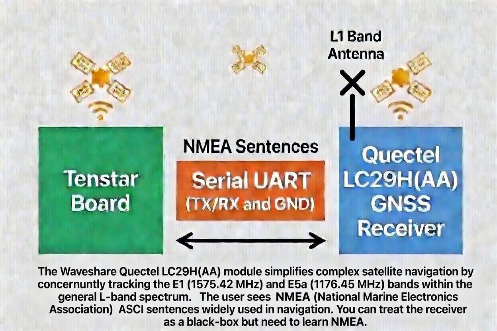

# Arduino Code

This folder contains Arduino programs for BIP26:

- BlinkTenstar.ino - Rund thge BLINK program on the TenStar board , red LED connected to pin 13
- NMEATestBasicLongComments,ino - receive NMEA sentences in the serial console, has lots of comments, pelase learn how this work
- BIP26_GNSS_Dsiiplay.ino  Displays GNSS data on TFT displacy
- Darmstadt25TFTDemo.ino  - Program by Eiken Luebbers to write to the TFT , does not need Waveshare board
- NMEATestBasicShort.ino - GEt NMEA sentences in seriial ports, minimal comments.
- QuectelLC29HFirmwareCheck.ino  - returns the firmware version number of the Quectel firmware.
- BIP26_GNSS_QualityGague - write graphic information about GNSS signals to the TFT display, requires Waveshare baord connectged to work
- BIP26_PVT_Display_Annotated - shows PVT information on TFT display 
- OSNMA_Checker.ino - OSNMA verification
- Multi_GNSS_Display.ino - Multi-constellation display
- Firmware_Version_Check.ino - Check GPS firmware
- Other files may be added
## BIP26 Graphic

